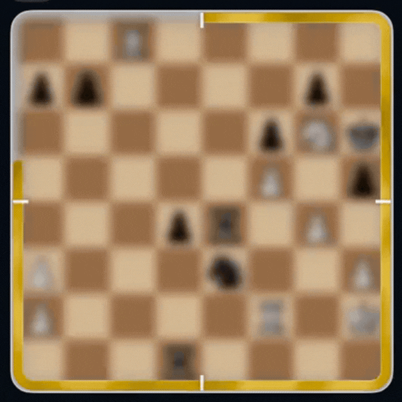

# Chess Clock

A macOS menu bar app that tells the time using real chess positions. Each hour displays a famous grandmaster game moments before checkmate. A new puzzle every hour.

> Pure SwiftUI + Metal. No chess engine. No network calls. No dependencies.


<p align="center">
  
</p>

<h3 align="center"><em>Can you tell what time it is?</em></h3>

---

## Features

### The Clock Face

The board is the dial. At 3 o'clock, you see the position 3 moves before checkmate. At 12, you're 12 moves out. The gold ring traces the minutes clockwise. The board flips at noon: White's perspective in the morning, Black's in the afternoon.



### Guess the Move

Tap the board to see who played and when. Tap again to enter the puzzle, enter the same position as the grandmaster. Drag or tap on pieces to move them and find the same checkmate sequence that happened. Three tries per hour, a new game resets at the top of every hour.


### Full Game Replay

After the puzzle, step through the entire game from move 1 to checkmate to review and learn. A zone-colored progress bar shows where you are: opening context, puzzle territory, or the winning line. Scrub with the bar or arrow keys.


### Floating Window

Pin the clock as a borderless floating panel that stays on top of other apps. Drag it anywhere. All features work identically.

### Global Shortcut

Press **Option + Space** from any app to toggle the clock. No clicking required.

---

## How It Works

| Element | What it represents |
|---------|-------------------|
| **Board position** | The hour (1-12). Hour N shows the board N moves before the final checkmate. |
| **Gold ring** | The minutes (0-59). Fills clockwise from the top. |
| **Board orientation** | AM or PM. White's perspective = morning. Black's = afternoon. |
| **Game rotation** | A new game every hour, selected by a per-device seed. Same hour, same device, same game. |

The app bundles 584 real games from grandmasters including Kasparov, Fischer, Carlsen, Tal, Capablanca, and others. All games ended in checkmate. Positions are precomputed by a Python pipeline; the app itself does zero chess computation for the clock display.

---

## Download

**[Download the latest release](https://github.com/luclacombe/chess-clock/releases/latest)**

Requires macOS 13 (Ventura) or later.

### Install

1. Download `ChessClock-x.x.x.dmg` from the [Releases page](https://github.com/luclacombe/chess-clock/releases)
2. Open the `.dmg` and drag **ChessClock** to your Applications folder
3. First launch: right-click the app and select **Open** (the app isn't notarized so you'll have to force open it in the Privacy & Security settings)
4. The app lives in your menu bar (2x2 board icon). Right click on the icon for settings.

---

## Building from Source

```bash
git clone https://github.com/luclacombe/chess-clock.git
cd chess-clock
open ChessClock/ChessClock.xcodeproj
# Build (Cmd+B) and Run (Cmd+R)
```

**Requirements:** macOS 13+, Xcode 15+

### Running Tests

```bash
xcodebuild test -project ChessClock/ChessClock.xcodeproj \
  -scheme ChessClock -destination 'platform=macOS'
```

150+ tests covering chess rules, game scheduling, puzzle engine, replay navigation, SAN formatting, board parsing, and service integration.

---

## Architecture

```
MenuBarExtra (crown icon)
  +-- ClockView (300x300, 5 view modes)
        +-- [clock]    BoardView + GoldRingLayerView (Metal noise shader, CALayer)
        +-- [info]     InfoPanelView (game metadata, puzzle CTA)
        +-- [puzzle]   GuessMoveView + InteractiveBoardView + PuzzleRingView
        +-- [replay]   GameReplayView + ReplayProgressBar + ReplayBackgroundView
        +-- [settings] SettingsPlaceholderView

ClockService (1s timer) --> ClockState --> all views
GameScheduler (deterministic) --> game from GameLibrary (games.json)
PuzzleEngine (pure struct) --> ChessRules (legal move generation)
```

**Key design decisions:**

- **Single source of truth.** `ClockService` publishes a `ClockState` struct every second. Views are pure display with no business logic.
- **Static game resolution.** `ClockService.makeState(at:)` is a static function. Pass any `Date` to test arbitrary times without a running timer.
- **Value-type puzzle engine.** `PuzzleEngine` is a pure struct with no side effects. Fully testable with hand-crafted game data.
- **Zero idle cost.** The Metal shader, noise timers, and clock timer all pause when the popover is hidden. CPU usage drops to 0%.

### Tech Stack

| Layer | Technology |
|-------|-----------|
| UI framework | SwiftUI (macOS 13+) |
| Ring + background animation | Metal compute shader (Perlin noise, IOSurface zero-copy blit to CALayer) |
| Chess rules | Custom implementation (512 lines, no library) |
| Global hotkey | Carbon Events API |
| Floating window | NSPanel subclass (borderless, non-activating) |
| Data pipeline | Python + python-chess |
| Dependencies | **Zero** Swift packages |

### Data Pipeline

A Python pipeline produces the bundled game database:

```
fetch_games.py      Download PGN archives from PGN Mentor (15 grandmasters)
        |
curate_games.py     Filter to checkmate-only games, deduplicate
        |
build_json.py       Extract 23 FEN positions + move sequences per game
        |
games.json          584 games, ~86K lines, bundled in app
```

```bash
cd scripts && pip install -r requirements.txt
python fetch_games.py && python curate_games.py && python build_json.py
cp games.json ../ChessClock/ChessClock/Resources/games.json
```

---

## Onboarding

First-time users see a animated and interactive 6-stage progressive onboarding system. Each stage teaches one concept at the moment the user encounters it: the board, the ring, the info panel, the puzzle, the replay scrubber. No front-loaded tutorials.

---

## Game Sources

Games are sourced from [PGN Mentor](https://www.pgnmentor.com/), a free archive of professional chess games. All games used ended in checkmate and feature players including Kasparov, Fischer, Carlsen, Anand, Kramnik, Karpov, Tal, Capablanca, Morphy, and others.

Chess piece artwork is the [cburnett set](https://commons.wikimedia.org/wiki/Category:SVG_chess_pieces/Standard_design) (public domain).

---

## License

MIT + Commons Clause. Free to use, modify, and share but not to sell. See [LICENSE](LICENSE).

The Python pipeline uses [python-chess](https://github.com/niklasf/python-chess) (GPL-3) for PGN parsing. It runs offline during development only and is not bundled in the app binary.

---

## Roadmap

See [docs/MAP.md](docs/MAP.md) for planned features and [docs/FUTURE.md](docs/FUTURE.md) for longer-term ideas.

---

## Contributing

Issues and PRs welcome. This is a portfolio project built in collaboration with [Claude Code](https://claude.ai/code).
